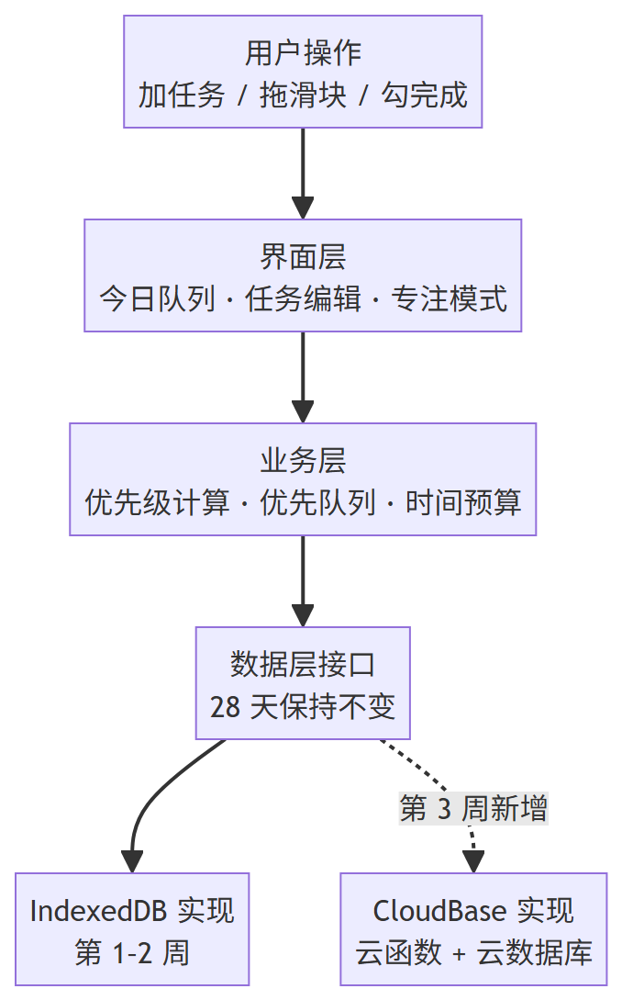

# TECH_DESIGN.md — 知先 · PriorKnow

> **技术设计文档** ｜ 依据：`PRD.md`（需求）+ `research.md`（竞品调研）
> 版本：v1.0 · 2026-09-20 ｜ 阶段：第 1 周 Day 5
> **本文档不写代码**，只写技术路线、结构、接口契约与数据流。

---

## 一、技术路线（一句话）

> **React + Vite + TypeScript**（前端） → **数据层接口** → **IndexedDB**（第 1–2 周）/ **CloudBase 云函数 + 云数据库**（第 3 周） → **CloudBase 静态网站托管**（部署）

**核心决策**：第 1–2 周**不做后端**，数据全部存在浏览器本地；第 3 周（课程 Day 15–21）再往数据层接口里加一个云端实现。

---

## 二、三层分工

| 层 | 职责 | 知先的实现 |
| --- | --- | --- |
| **前端** | 展示与交互：页面长什么样、点了有什么反应 | React 应用，含今日队列、任务编辑、专注模式、数据设置四个视图 |
| **后端** | 业务规则与数据接口：用户看不见的判断与读写服务 | **第 1–2 周：没有**（理由见下）；**第 3 周**：CloudBase 云函数 |
| **数据库** | 长期保存数据，不管业务 | **第 1–2 周**：浏览器内置 IndexedDB；**第 3 周**：CloudBase 云数据库 |

### 2.1 为什么第 1–2 周不要后端

1. **没有「谁的数据」问题** —— 无账号、单用户，后端最核心的权限判断用不上；
2. **算法放前端更快** —— 优先级计算与队列重排是纯计算，本地跑才能让拖动滑块时「1 秒内重排」；
3. **部署成本差一个量级** —— 纯前端只要静态托管；引入后端就要处理服务器、数据库连接、跨域、密钥，全属 Day 15 之后的内容。

### 2.2 为什么第 3 周必须加后端

多端同步要求数据离开设备：需要账号识别用户、需要云数据库长期保存、需要接口供多端读写。**这三件事正好是课程 Day 15–21 的教学内容**，不是额外负担。

### 2.3 关键设计：数据层接口

界面层与业务层**只依赖「数据层接口」**，不直接接触任何数据库。

- 第 1–2 周：接口背后挂 **IndexedDB 实现**；
- 第 3 周：接口背后再挂一个 **CloudBase 实现**；
- **整个 28 天，接口本身与上层代码不动。**

这条设计让第 3 周的工作从「重写应用」变成「换一个零件」。

---

## 三、方案比较

> 比较维度取自课程提示词：学习成本、线上持久化、费用、排错难度。
> 结论：**每栏标注 ⭐ 的是推荐项**。

### 3.1 前端框架

| 方案 | 学习成本 | 生态与 AI 辅助 | 与知先匹配度 | 结论 |
| --- | --- | --- | --- | --- |
| ⭐ **React + Vite + TypeScript** | 中（有 JS 基础可上手） | 生态最大，AI 生成的样板最成熟；TS 能在写错时提前报错 | 高：四视图 + 队列动画，组件化拆得开 | **选它** |
| Vue 3 + Vite | 中偏低（模板语法更直观） | 生态良好，中文资料多 | 高 | 备选，无必要更换 |
| 原生 HTML/CSS/JS | 低 | 无需构建工具 | **低**：队列重排动画与状态管理会迅速失控 | 不选 |

**理由**：本项目真正的难点是「状态变化 → 队列重排 → 动画」，需要靠组件化和类型约束来控住复杂度。原生方案在第三天就会写不下去。

### 3.2 后端服务

| 方案 | 学习成本 | 线上持久化 | 费用 | 排错难度 | 结论 |
| --- | --- | --- | --- | --- | --- |
| ⭐ **第 1–2 周：不要后端** | 无 | 不需要 | ¥0 | 无 | **先选它** |
| ⭐ **第 3 周：CloudBase Node.js 云函数** | 中（课程有专门指导手册） | 有 | 免费体验版 3,000 资源点/月，量级够用 | 中：有控制台日志可查 | **第 3 周选它** |
| 自建 Node.js + Express | 高 | 有 | 需租服务器 | 高：要自己管进程、端口、HTTPS、跨域 | 不选 |

**理由**：第 1–2 周引入后端属于「提前做 Day 15 的事」，且会让 28 天内最该打磨的前端与算法让位。第 3 周课程本来就要教 CloudBase，那时接入最省力。

### 3.3 数据库

| 方案 | 学习成本 | 线上持久化 | 费用 | 排错难度 | 结论 |
| --- | --- | --- | --- | --- | --- |
| ⭐ **IndexedDB（浏览器内置）** | 中（用 Dexie.js 封装后接近普通 JS） | 无（仅本设备） | ¥0 | 低：浏览器 DevTools 可直接查看 | **第 1–2 周选它** |
| CloudBase 文档型数据库 | 中 | 有 | 含在免费额度内 | 中：控制台可查 | 第 3 周备选 |
| CloudBase PostgreSQL | 中偏高（要写 SQL） | 有 | 免费体验版是否包含**待核实** | 中 | 第 3 周备选 |

**理由**：知先是个人任务工具，数据量在几百条量级，且 PRD 明确要求「断网可用」。IndexedDB 完全够用，还省掉了网络延迟与费用。

> ⚠️ **待核实**：CloudBase 免费体验版是否包含 PostgreSQL，或仅含文档型数据库。这一点在 Day 15 注册时按控制台实际显示确认，不影响第 1–2 周。

### 3.4 部署

| 方案 | 学习成本 | 费用 | 与课程衔接 | 结论 |
| --- | --- | --- | --- | --- |
| ⭐ **CloudBase 静态网站托管** | 低 | 含在免费额度内（1GB 空间） | **直接衔接 Day 15–21**，前后端同一平台 | **选它** |
| Vercel / Netlify | 低 | 免费额度充足 | 与课程 CloudBase 主线脱节，第 3 周要维护两套平台 | 备选 |
| GitHub Pages | 低 | 免费 | 同上，且自定义配置项少 | 备选 |

**理由**：第 3 周前端与云函数要放在同一平台才能避免跨域麻烦，提前用同一平台可减少一次迁移。

---

## 四、项目结构

```
priorknow/
├── core/                  # 核心算法（纯 TypeScript，不依赖 React）
│   ├── priority.ts        # 优先级公式（权重集中在这里）
│   ├── priorityQueue.ts   # 优先队列 / 二叉堆（上浮、下沉）
│   ├── scheduler.ts       # 今日时间预算筛选
│   ├── parser.ts          # 自然语言解析（本地规则版）
│   └── types.ts           # 类型定义
├── data/                  # 数据层（关键：上层只认这里的接口）
│   ├── repository.ts      # 数据层接口定义（契约）
│   ├── local-indexeddb.ts # 第 1–2 周：IndexedDB 实现
│   └── cloud-cloudbase.ts # 第 3 周：CloudBase 实现
├── ui/                    # 界面层（四个视图）
│   ├── TodayQueue.tsx     # 视图一：今日队列（首页）
│   ├── TaskEditor.tsx     # 视图二：任务详情 / 编辑
│   ├── FocusMode.tsx      # 视图三：专注模式
│   └── DataSettings.tsx   # 入口：数据与设置
├── shared/                # 通用组件与状态管理
└── docs/                  # 项目文档（research / PRD / 本文档）
```

**结构对照 PRD**（检查项目结构是否对应页面与功能，以及每个功能由哪个接口读写）：

| PRD 功能 | 显示在哪个页面 | 由哪个接口 / 模块读写 |
| --- | --- | --- |
| F1 任务增删改查 | 视图一 今日队列 / 视图二 任务编辑 | `data/`：`createTask` · `updateTask` · `deleteTask` · `completeTask` |
| F2 自动优先级计算 | 视图一（卡片上的分数） | `core/priority.ts`（纯计算，不读写存储） |
| F3 优先队列可视化 | 视图一 今日队列 | `core/priorityQueue.ts` + `listTasks()` 取数 |
| F4 队列重排动画 | 视图一 | `ui/TodayQueue.tsx` 渲染，数据来自 `core/priorityQueue.ts` |
| F5 可解释排序 | 视图一（展开卡片） | `core/priority.ts` 产出理由文本 |
| F6 今日时间预算 | 视图一（顶部预算框） | `core/scheduler.ts` + `listTasks()` 取数 |
| F7 专注模式 | 视图三 专注模式 | `core/priorityQueue.ts` 取队首 + `completeTask()` |
| F8 本地保存与导入导出 | 入口 数据与设置 | `exportAll()` · `importAll()` |
| F9 示例数据 | 视图一（空状态按钮） | 内置种子 JSON → 调用 `importAll()` 写入 |
| 自然语言添加 | 视图一（加任务输入框） | `core/parser.ts` 解析 → 再走 `createTask()` |

**结论**：9 个 MVP 功能与 1 个解析功能**全部有对应的接口或模块**，无悬空功能。

| PRD 的视图 | 对应位置 |
| --- | --- |
| 视图一 今日队列（首页） | `ui/TodayQueue.tsx` |
| 视图二 任务详情 / 编辑 | `ui/TaskEditor.tsx` |
| 视图三 专注模式 | `ui/FocusMode.tsx` |
| 入口 数据与设置 | `ui/DataSettings.tsx` |

**关键约束**：`core/` 不依赖 React。好处是算法能独立测试，且未来转小程序时 UI 重写、算法直接复用。

---

## 五、数据模型

**任务（Task）** —— 唯一的核心数据对象。

| 字段 | 类型 | 说明 | 必填 |
| --- | --- | --- | --- |
| `id` | string | 唯一标识，系统生成 | 系统 |
| `title` | string | 任务内容 | ✅ |
| `dueAt` | string \| null | 截止时间（ISO 格式） | 可空 |
| `estimateMinutes` | number \| null | 预计耗时（分钟） | 可空 |
| `importance` | 1–5 | 重要度（星级） | ✅ 默认 3 |
| `status` | `todo` \| `doing` \| `done` | 当前状态 | 系统 |
| `createdAt` | string | 创建时间，用于同分时排序 | 系统 |

> **派生值不入库**：优先级分数、紧迫度、排序理由都由 `core/priority.ts` 实时算出，**不存进数据库**。理由：权重一旦调整，存的分数就全过期了；实时算保证「界面显示的分数」永远和「当前公式」一致。

**不建的字段**：`dependencyIds`（依赖任务）—— PRD 第四节已把「复杂依赖关系」列为本期不做。

---

## 六、数据层接口（契约）

> 这是「上层只认这一层」的具体内容。第 1–2 周与第 3 周是两个实现，但接口不变。

| 方法 | 入参 | 返回 | 说明 |
| --- | --- | --- | --- |
| `listTasks()` | 无 | `Task[]` | 读取全部任务 |
| `getTask(id)` | `id` | `Task \| null` | 读取单个任务 |
| `createTask(input)` | 除 id/createdAt/status 外的字段 | `Task` | 新增任务 |
| `updateTask(id, patch)` | `id`, 待改字段 | `Task` | 修改任务 |
| `deleteTask(id)` | `id` | `void` | 删除任务 |
| `completeTask(id)` | `id` | `Task` | 标记完成 |
| `exportAll()` | 无 | `Task[]` | 导出全部（对应 PRD F8） |
| `importAll(tasks)` | `Task[]` | `void` | 导入覆盖（需先提示用户） |

**两个实现的差异只在内部**：

| | IndexedDB 实现 | CloudBase 实现（第 3 周） |
| --- | --- | --- |
| 存储位置 | 浏览器本地 | 云端数据库 |
| 是否需网络 | 否 | 是 |
| 用户身份 | 无（本机即本人） | 需登录 |
| 上层代码 | **完全相同** | **完全相同** |

---

## 七、数据流图



<details>
<summary>mermaid 源码（点开可复制修改）</summary>

```text
flowchart TD
    U["用户操作<br/>加任务 / 拖滑块 / 勾完成"] --> UI["界面层<br/>今日队列 · 任务编辑 · 专注模式"]
    UI --> BIZ["业务层<br/>优先级计算 · 优先队列 · 时间预算"]
    BIZ --> IFACE["数据层接口<br/>28 天保持不变"]
    IFACE --> IDB["IndexedDB 实现<br/>第 1–2 周"]
    IFACE -.->|第 3 周新增| CB["CloudBase 实现<br/>云函数 + 云数据库"]
```

</details>

**这张图在说什么（数据从哪来、到哪去）**：

1. **来**：用户在前端操作（加任务、调重要度、勾完成）；
2. **算**：业务层根据任务属性算出优先级，排成队列（这一步没有网络，所以快）；
3. **存**：结果通过**数据层接口**写入存储——第 1–2 周写进浏览器的 IndexedDB，第 3 周写进云端；
4. **回**：存储返回最新数据，业务层重新排序，界面带动画重排。
   （图中只画了「去」的下行流；「回」走的是同一条路径的反方向，画出来会形成闭环，反而看不清。）

**关键点**：第 3 周接入云端时，只有图中 `数据层接口 → CloudBase` 这条虚线是新增的，**其余部分一动不动**。

> **画图备注**：本图源码是 mermaid，此处改用渲染好的图片（`docs/data-flow.png`）。原因是 GitHub 页面渲染这段 mermaid 时报错 `Could not find a suitable point for the given distance`；而同一份代码在本地 mermaid v10 与 v11 下都能正常渲染，说明问题出在渲染环境而非图的写法。改用图片可确保任何环境下都能看到这张图，源码仍保留在上方折叠块里可随时修改。
>
> 另外，图中只画「去」的下行流，不画回程——回程走的是同一条路径的反方向，画成闭环反而看不清。

---

## 八、错误处理

| 情况 | 处理方式 | 依据 |
| --- | --- | --- |
| 本地存储写入失败（如隐私模式、空间满） | 明确提示「保存失败，请先导出备份」，不静默丢数据 | PRD 第七节 |
| 导入文件格式不正确 | 中文提示「文件格式不正确，已保留你原来的数据」，原数据不动 | PRD 第七节 |
| 网络不可用 | 第 1–2 周无影响（无网络依赖）；第 3 周云端实现需降级为「本地继续可用，云端待同步」 | PRD F8 |
| 任务无截止时间 | 不参与紧迫度计算，排在有时限任务之后，卡片标注「无期限」 | PRD 第七节 |
| 今日预算小于最短任务 | 提示「今天的时间不够完成任何一项」，给出「改预算」「查看全部任务」两条出路 | PRD 第七节 |
| 算法算出异常分数（如除零、NaN） | 兜底为最低优先级，并在控制台记录，不让界面崩溃 | 本文档新增 |

---

## 九、环境变量

| 阶段 | 需要的变量 | 存放位置 |
| --- | --- | --- |
| 第 1–2 周 | **无**（纯前端，无密钥） | — |
| 第 3 周 | CloudBase 环境 ID（非密钥，可公开） | 配置文件 |
| 第 3 周 | 云函数所需的任何密钥（若有） | **只放 CloudBase 控制台的环境变量，绝不写进代码、绝不提交仓库** |

**红线**：`.env` 与任何密钥文件已在 `.gitignore` 中，永不入库。

---

## 十、部署与迁移注意事项

1. **第 1–2 周部署**：构建静态产物 → 上传 CloudBase 静态托管。不需要服务器。
2. **本地优先的承诺**：任何操作**先写本地**，立即返回结果，不等网络。这是 PRD F8 的要求，也决定了第 3 周的云端设计必须是「本地 + 可选同步」，而不是「云端为准」。
3. **迁移（第 3 周）要注意的三件事**：
   - **导出先行**：迁移前先用现有导出功能备份一份 JSON，作为回滚手段；
   - **不做自动覆盖**：本地已有数据 + 云端已有数据时，必须让用户选「以本地为准 / 以云端为准 / 合并」，绝不静默覆盖；
   - **免费额度留意**：Day 15 注册时记下环境 ID、剩余额度、到期日期三项；Day 26 有一次专门的额度检查。
4. **跨域（CORS）**：第 3 周云函数只允许自己的静态托管域名，**禁止使用 `*` 通配符**。

---

## 十一、尚未决定的地方

| # | 待定事项 | 为什么现在不定 | 何时定 |
| --- | --- | --- | --- |
| 1 | 优先级公式的具体权重与函数形态 | 课程约定属于 Day 5 之后逐步调参；首版先用朴素权重跑起来 | Day 7 起边做边调 |
| 2 | CloudBase 用文档型数据库还是 PostgreSQL | 需在 Day 15 注册后按控制台实际可选范围确认 | Day 15 |
| 3 | 第 3 周云端是「仅备份恢复」还是「实时双向同步」 | 后者要处理冲突合并（两台设备同时改同一任务），复杂度高；先用简单方案 | Day 15 前后 |
| 4 | 动画库选 Framer Motion 还是纯 CSS 动画 | 取决于实际动画复杂度，先写朴素版再决定 | 第 2 周 |
| 5 | 自然语言解析覆盖的句式清单 | 与实测有关，先做「时间 + 时长 + 重要度」三种 | 第 2 周 |

---

_本文档由 AI 依据 `PRD.md` 生成，方案取舍经项目主人确认 ｜ 2026-09-20_
